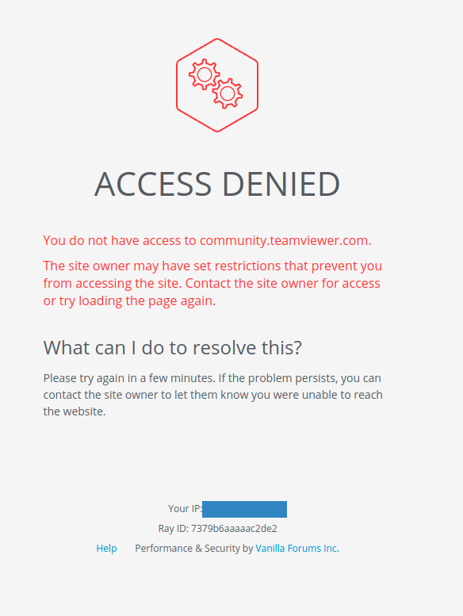
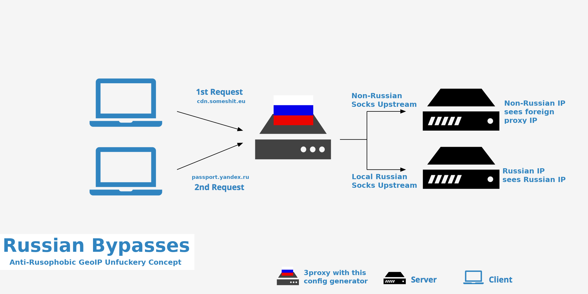
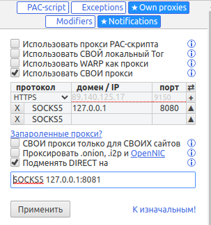

# russian-bypasses
bypassing anti-russian geoip filters with simple concept

# Проблема (много таких)


Из поисковика уже некоторые ссылки не открываются. Админы блочат на уровне CDN, выставляют геоблок для России. А просто под ВПНом сидеть не удобно, потому что нужно еще в Альфабанк, Сбербанк и прочие сервисы заходить, а заходить в них надо с русского айпи, или получите опять же геоблок, либо в совсем упоротых случаях служба безопасности заблокирует счет и придется тащится в банк.

На обиженных воду возят как говорится, вот и мы будем возить.

# Решение


Все гениальное просто, и все простое хорошо работает. Если блочат по геоайпи, почему бы и не роутить по геоайпи?

# Описание скрипта
Данный скрипт генерирует конфиг для прокси-сервера 3proxy используя бесплатные базы ip2location. Все rangы РФ и СНГ роутит напрямую (точнее через свой же апстрим, а потом напрямую), все остальное через ваш Shadowsocks/Socks и какой угодно другой апстрим, главное что бы на нем был открыт порт для принятия Socks5 коннектов. Геоайпи базы очевидно можно обновлять. Я лично роучу через апстрим-сокс сервер размещенный мной же в игдразиле потому, что так просто-напросто стабильнее с моими тремя отваливающимися провайдерами.

# Роскомнадзор
Возможно мой концепт автоматически обходит большинство блокировок, так как все заблокированные сайты и так уже давно прячутся за CDNами. Однако если нужно, можно прикрутить мой солюшн в плагин Runet-censorship-bypass. Для этого в качестве своего прокси указываете ваш прокси забугром, и ставите опцию подменять DIRECT на "SOCKS5 127.0.0.1:8081". Тогда произойдет двойной анфак вашего браузера и будут работать сразу два солюшна (сначала плагин со списками, затем этот прокси с геоайпи).


# Использование наоборот
Если вы находитесь вне РФ и вам нужно наоборот попадать в российские банки, то поменяйте местами строки

```parent 1000 socks5 127.0.0.1 $serviceport```

и

```parent 1000 socks5 $upstreamhost $upstreamport```

Таким образом конфиг будет работать инверсивно, тоесть все русские айпи пойдут через ваш русский сокс, все остальное - напрямую.


# Скачать 3proxy
https://3proxy.ru/download/

# Обновить GeoIP базы
https://download.ip2location.com/lite/

# Чекнуть айпи в РФ
https://www.reg.ru/web-tools/myip

# Чекнуть айпи забугром
https://myip.wtf
